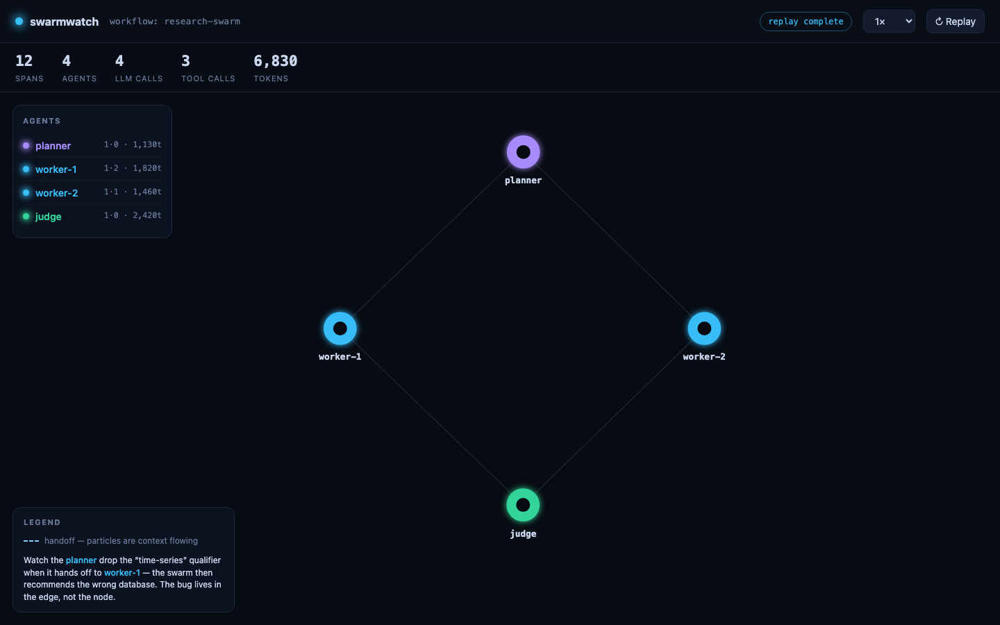
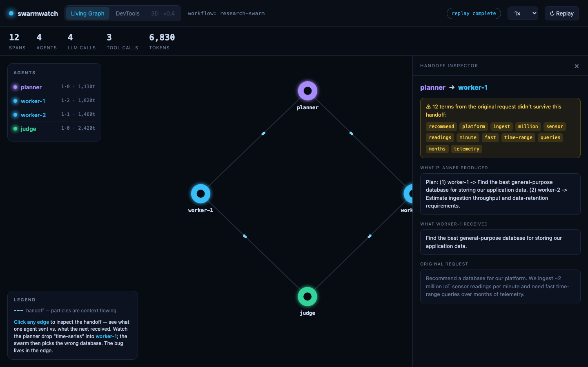
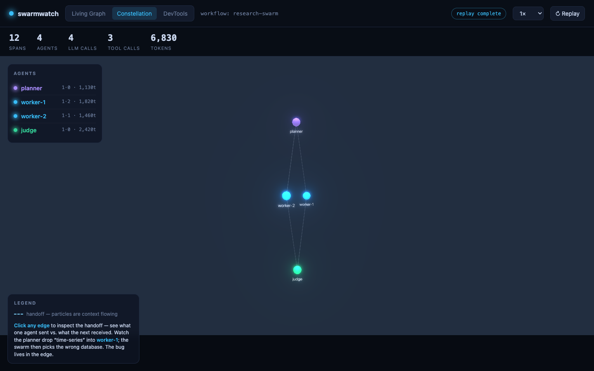

<h1 align="center">swarmwatch</h1>

<p align="center">
  <b>A flight recorder for AI agent swarms.</b><br>
  Watch your agents think — live — then scrub back to find the exact moment one handed bad context to another.
</p>

<p align="center">
  <i>🚧 Building in public. Follow along — releases land in stages (see the <a href="ROADMAP.md">roadmap</a>).</i>
</p>

<p align="center">
  
</p>
<p align="center"><sub>The Living Graph (v0.2): a planner→worker→judge swarm. During a run, handoffs animate as particle flows and nodes pulse as they fire LLM/tool calls.</sub></p>

---

## The problem

Multi-agent systems fail *in the space between agents*. A planner subtly mis-frames a subtask, a tool result gets lossily summarized before it reaches the next agent, and the bug only surfaces three hops later in a final answer that's quietly wrong. Today's agent-observability tools render all of this as **span trees and Gantt waterfalls** — accurate, but you can't *see* the swarm, and the handoffs (where the bugs live) are buried in a flat list.

## What swarmwatch does

swarmwatch ingests agent traces over the **OpenTelemetry GenAI** standard and renders them as a **live, animated topology** — agents as nodes, handoffs as glowing edges, tool calls pulsing, tokens and cost streaming in real time. Then you can scrub backward through the run and **click any edge to see the exact prompt and response that crossed between two agents**, with a diff that surfaces what got lost in translation.

Because it speaks OpenTelemetry, it works with **LangGraph, CrewAI, AutoGen, the OpenAI Agents SDK, or a hand-rolled loop** — no bespoke SDK required. And it runs **local-first**: `pip install`, point your traces at it, open your browser. No account, no cloud.

## Three ways to see a run

| View | What it's for |
|------|---------------|
| **Living Graph** (2D) | The hero view. A GPU force-directed graph where the swarm *breathes* — particle flow along edges on every handoff, nodes pulsing as tools fire. |
| **Constellation** (3D) | The same topology in 3D with bloom — built for understanding (and screenshotting) large swarms at a glance. |
| **DevTools** | The serious debugger: structured workflow graph + span flamegraph + the **Handoff Inspector** that diffs what each agent sent vs. what the next one actually received. |

<p align="center">
  
</p>
<p align="center"><sub>The Handoff Inspector (v0.3): click the planner→worker-1 edge and see the terms — “time-series”, “telemetry”, “sensor readings” — that didn’t survive the handoff. The bug lives in the edge, not the node.</sub></p>

<p align="center">
  
</p>
<p align="center"><sub>The 3D Constellation (v0.4): the same topology, rendered with bloom on a near-black field. Slow auto-rotation when live; <code>?rotate=0</code> for a static frame.</sub></p>

## Status

Building in public, in stages. See **[ROADMAP.md](ROADMAP.md)** for what's shipping when.

- **v0.1 — *It records*** · ingest + replay + span model — ✅ shipped
- **v0.2 — *It comes alive*** · the 2D Living Graph — ✅ shipped
- **v0.3 — *It debugs*** · DevTools mode + Handoff Inspector — ✅ shipped
- **v0.4 — *It's beautiful*** · 3D Constellation — ✅ shipped
- **v1.0 — *Launch*** · SDK, OTLP receiver, Live mode, framework integrations, hosted demo — _in progress_

## Quickstart

```bash
git clone https://github.com/pb-commits-it/swarmwatch
cd swarmwatch
python -m venv .venv && source .venv/bin/activate
pip install -e .
swarmwatch up
```

Open **http://127.0.0.1:8000** and watch the bundled planner→worker→judge swarm replay live in the **Living Graph** — handoffs animate as particle flows, nodes pulse as they fire LLM/tool calls. Switch to **DevTools** for the span flamegraph, and **click any handoff edge** to open the Inspector and see the context that got dropped between agents. Point it at your own recorded run with `swarmwatch up --trace path/to/trace.jsonl`.

> v0.4 ships all three view modes — Living Graph, 3D Constellation, DevTools — plus the Handoff Inspector. v1.0 adds the live ingest endpoint + Python SDK so you can point your own agents at it (see below).

## Use it with your own agents

Instrument any Python code in a few lines — the SDK is a thin layer over the OpenTelemetry GenAI conventions, so the same spans work with any OTel backend, not just swarmwatch:

```bash
pip install 'swarmwatch[sdk]'
swarmwatch up &
```

```python
from swarmwatch.sdk import SwarmWatch

sw = SwarmWatch()  # POSTs OTel-GenAI traces to http://127.0.0.1:8000/v1/traces

with sw.workflow("research-swarm", input=user_request):
    with sw.agent("planner", inputs_from=[], input=user_request):
        with sw.chat("grok-4.20", input=user_request, output=plan,
                     input_tokens=850, output_tokens=280):
            ...
    with sw.agent("worker-1", inputs_from=["planner"], input=subtask):
        with sw.tool("web_search", output=results):
            ...
        with sw.chat("grok-4.20", output=recommendation,
                     input_tokens=1400, output_tokens=420):
            ...

sw.shutdown()
```

Open **http://127.0.0.1:8000/?mode=live** and watch your swarm light up. A complete worked example is in [`examples/from_scratch_loop.py`](examples/from_scratch_loop.py).

Already on OpenTelemetry? Point your existing OTLP exporter at `/v1/traces` (protobuf or JSON) — no SDK required.

## How it works

```
agent app (LangGraph / CrewAI / AutoGen / OpenAI SDK / custom)
   │  OpenTelemetry GenAI spans  (OTLP)  ·  or thin decorator SDK  ·  or .jsonl replay
   ▼
swarmwatch backend (FastAPI)
   ingest → normalize (OTel-GenAI + OpenInference) → causal-DAG builder → DuckDB
   │  SSE: span events · token deltas · layout deltas      WS: pause / step / scrub
   ▼
swarmwatch web (React + cosmos.gl / react-three-fiber / React Flow)
   Living Graph  ·  Constellation  ·  DevTools  +  timeline scrubber  +  detail panel
```

Full design rationale in **[docs/ARCHITECTURE.md](docs/ARCHITECTURE.md)**.

## License

[MIT](LICENSE) © Paul Bergeron
